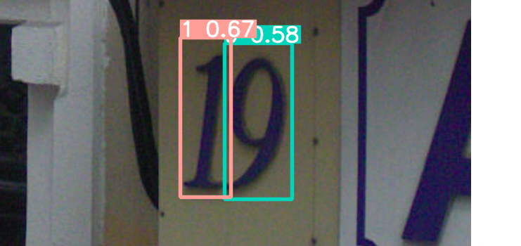

# SVHN Yolov5



## Preprocess

### 1. Prepare data

Make a directory named "svhn" in repo root, download and unzip the train.zip and test.zip in it, arange like the below structure.

P.S. The data used in this repo is provided by the course VRDL.

```text
repo_root/
  +- svhn/
  | + train/
  | | + 1.png
  | | + ...
  | | + 33402.png
  | | + digitStruct.mat
  | + test/
  | | + images/
  | | | + 1.png
  | | | + ...
  | | | + 13068.png
  +- data/
  +- models/
  +- utils/
  ...... etc
```

### 2. Preprocess

```shell script
cd svhn_yolov5
python3 preprocess.py
```

## Training

Example of training a yolov5m:
```shell script
python3 train.py --img 256 --batch 256 --epoch 500 --data data/SVHN.yaml --weights ''  --hyp data/hyps/hyp.scratch.yaml --adam --cfg models/yolov5m.yaml --save-period 10 --bbox_interval 5 --name yolov5m
```
Use `-h` argument to see more details.

## Testing 

Example:
```shell script
python3 val.py --data data/SVHN.yaml --weights pretrained.pt  --batch-size 128 --imgsz 256 --task test --verbose --device 0,1 --save-json --iou-thres 0.7 --conf-thres 0.001
```

## Inference

### Detect an image

Example:
```shell script
python3 detect.py --weights pretrained.pt  --source svhn/train/example.png --name detect --iou-thres 0.6 --conf-thres 0.25 --imgsz 256
```
### or use the below Colab Notebook:

[Colab Notebook](https://colab.research.google.com/drive/1HpMbE9zK_oijZgPaI0Rncuqa0HAGe7b6?usp=sharing)

## Pretrained Model

https://drive.google.com/file/d/1rdJkcAguTLCCun_towdtJZdKpk2egxIw/view?usp=sharing

## Reference

- preprocess.py is revised from [here](https://github.com/072jiajia/CVDL_HW2/blob/main/prepare.py). 
- yolo v5: https://github.com/ultralytics/yolov5    
- SVHN: Yuval Netzer, Tao Wang, Adam Coates, Alessandro Bissacco, Bo Wu, Andrew Y. Ng Reading Digits in Natural Images with Unsupervised Feature Learning NIPS Workshop on Deep Learning and Unsupervised Feature Learning 2011. (http://ufldl.stanford.edu/housenumbers)

